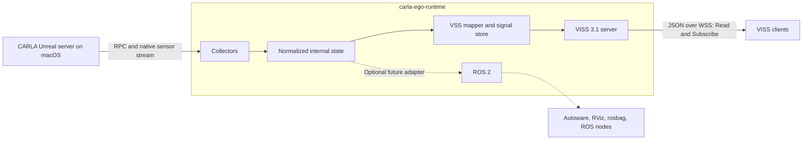

# Architecture

## Goal

Run one ego vehicle in a CARLA city, collect a deliberately small initial set
of vehicle-state and GNSS signals, and expose them to network clients through a
stable COVESA VISS interface.

## System boundary

The CARLA/Unreal server remains responsible for the world, physics, vehicle,
and GNSS actor. This repository owns the ego-vehicle lifecycle, collection,
normalization, VSS mapping, simulation metadata extension, and VISS endpoint.

## Initial components

1. **Runtime** — connects to a running CARLA server and selects or spawns the
   configured ego vehicle.
2. **Vehicle-state collector** — reads velocity, acceleration, last-applied
   control, extended telemetry, and front-wheel steer angles.
3. **GNSS collector** — attaches one `sensor.other.gnss` actor and receives
   fixes through the native CARLA sensor callback.
4. **Frame assembler** — associates measurements with a simulation run, frame,
   and timestamp and prevents unbounded buffering.
5. **Normalizer** — converts CARLA coordinates and native values into explicit
   physical quantities without depending on VISS or ROS 2.
6. **VSS mapper and signal store** — maps normalized values to the VSS 6.0
   tree, performs unit conversions, and adds the documented CARLA simulation
   overlay.
7. **VISS server** — exposes the signal tree using the project VISS 3.1
   compatibility profile.

## VISS boundary

VISS is the external service contract, not merely a serialization wrapper. The
initial profile fixes the following choices:

- COVESA VISS 3.1 semantics;
- a VSS 6.0 signal tree plus the documented simulation overlay;
- JSON primary payload encoding;
- Secure WebSocket (`wss`) transport;
- `get`, `subscribe`, and `unsubscribe` for consumers;
- protocol-valid `set` handling, but no writable signal nodes in the initial
  tree.

The specification requires Read and Update support at the transport level.
Therefore the server must parse Update requests and return a standard VISS
error for read-only nodes; it must not silently invent actuator semantics. A
fully conformant implementation and its test suite are an M4 deliverable.

Whether the endpoint embeds a native VISS implementation or connects the
runtime to the COVESA VISS reference implementation (VISSR) remains an
implementation decision. It does not change the public interface.

## Deliberate choices

- C++20 is used because the installed native LibCarla package requires it on
  the target Apple Silicon machine.
- The runtime is the designated synchronous tick owner by default and uses a
  0.05 second fixed delta (20 simulation frames per second). Observer mode is
  explicit and requires a different client to own the clock.
- Vehicle state is sampled every simulation frame; GNSS initially runs at
  10 Hz.
- CARLA's internal RPC and streaming protocol is not the public contract.
- VSS units and meanings take precedence at the external boundary; native or
  SI values may be retained internally.
- ROS 2 is an optional edge adapter, never the required path between CARLA and
  VISS. See [Role of ROS 2](ros2-role.md).

## Dependency boundary

The native build links against an installed LibCarla package. It does not
vendor CARLA or use a CARLA/Unreal Engine source checkout as a Git submodule.
The tested commit and installation procedure are recorded in the
[native macOS setup](carla-setup-macos.md). The default build keeps CLI and
documentation tests available without LibCarla;
`CARLA_EGO_WITH_CARLA=ON` enables the native adapter.

The previous CARLA world settings are restored before a runtime-owned ego
vehicle is destroyed. Each tick replaces one snapshot in the VSS latest-value
store. The core normalizer, projection, and store do not include LibCarla
headers, which keeps their behavior deterministic and unit-testable.

VSS and VISS versions are pinned at the interface boundary. Referencing their
specifications does not require vendoring their source. Any future reuse of
COVESA code, generated schemas, or VISSR is subject to its MPL-2.0 licence and
must be recorded explicitly.
