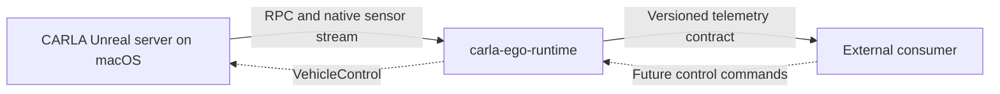

# Architecture

## Goal

Run one ego vehicle in a CARLA city, collect a deliberately small initial set
of vehicle-state and GNSS signals, and make those signals available to an
external consumer through a stable interface.

## System boundary

The CARLA/Unreal server remains responsible for the world, physics, vehicle,
and GNSS actor. This repository owns the ego-vehicle lifecycle, telemetry
normalization, synchronization, and the future external network adapter.

## Initial components

1. **Runtime** — connects to a running CARLA server and selects or spawns the
   configured ego vehicle.
2. **Vehicle-state collector** — reads velocity, acceleration, last-applied
   control, extended telemetry, and front-wheel steer angles.
3. **GNSS collector** — attaches one `sensor.other.gnss` actor and receives
   fixes through the native CARLA sensor callback.
4. **Frame assembler** — associates measurements with simulation frame and
   timestamp and prevents unbounded buffering.
5. **Publisher adapter** — will expose the versioned contract through a
   transport chosen after the first external consumer is identified.

## Deliberate choices

- C++17 is used because the native LibCarla client already builds on the target
  Apple Silicon machine.
- The first implementation will use synchronous mode with a 0.05 second fixed
  delta (20 simulation frames per second).
- Vehicle state is sampled every simulation frame; GNSS initially runs at
  10 Hz.
- The external transport is not selected in the scaffold. CARLA's internal RPC
  and streaming protocol will not be presented as the stable public contract.
- Native ROS 2 inside CARLA is not a first-milestone dependency.

## Dependency boundary

The project will link against an installed LibCarla package. It will not vendor
CARLA or use a CARLA/Unreal Engine source checkout as a Git submodule. A tested
CARLA commit and installation procedure will be recorded when connectivity is
implemented.
